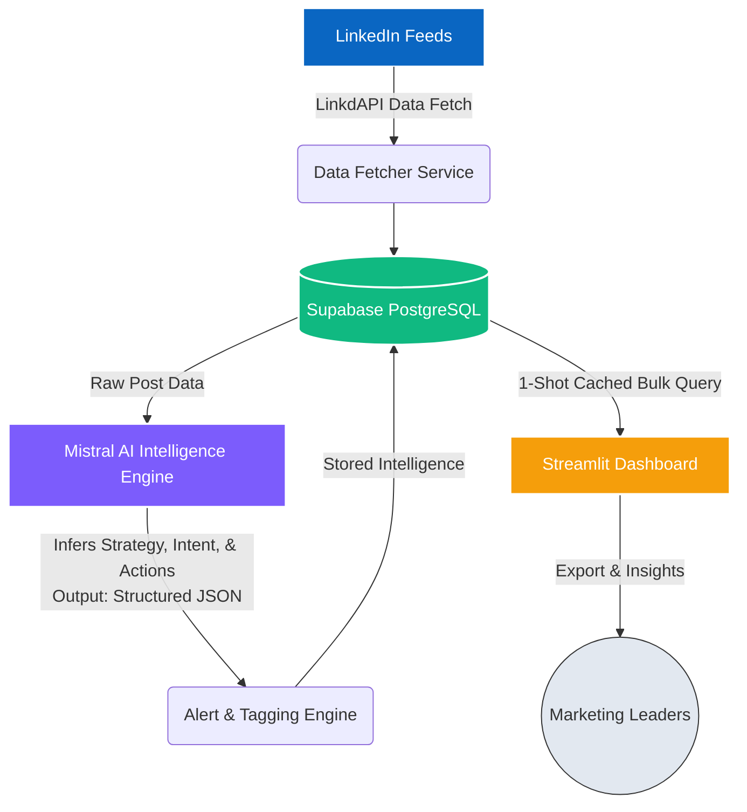

# 📊 LinkedIn Competitive Intelligence Dashboard

An end-to-end automated pipeline and intelligence dashboard built for **The Hartford India**. It tracks, analyzes, and contextualizes LinkedIn activity from key competitors (Vanguard India, Chubb, HCA Healthcare India, Lloyds Technology Centre India, Carelon Global Solutions India) to extract strategic marketing insights.

---

## 🎯 What this project does

This project goes beyond vanity metrics (like/comment counting). It takes raw competitor LinkedIn posts and transforms them into **actionable intelligence**. 

1. **Automated Data Extraction**: Safely fetches the latest LinkedIn posts, media, and engagement metrics from our competitor list using LinkdAPI.
2. **AI-Powered Analysis**: Feeds unstructured post data into Mistral AI to evaluate the *strategic intent*, dissect the *creative format*, and define *actionable takeaways* for our internal marketing team.
3. **Automated Alerting**: Uses an engagement baseline algorithm to flag high-performing posts as **"HIGH PRIORITY"** so our leaders never miss a trending post.
4. **Executive Dashboard**: A visually stunning, dark-themed Streamlit dashboard that serves the analyzed data instantly with seamless filtering and Excel export capabilities.

---

## 🏗️ Technical Architecture

The architecture is designed to be highly scalable, using a decoupled backend storage model so that the frontend remains lightning-fast.

### 1. Data Pipeline (`main.py` & `services/`)
- Fetches recent posts and elegantly handles edge cases (like image-only posts with no text).
- Deduplicates data using LinkedIn URNs to ensure clean data.
- Evaluates the engagement rate against that specific company's historical baseline to see if the post is over-indexing.

### 2. The AI Brain (`services/intelligence.py`)
Uses `LangChain` and **Mistral AI** to strictly format responses into a 9-part strategic profile, tracking:
- **Executive Snapshot**
- **Strategic Intent**
- **Competitive Insight**
- **Recommended Action**

### 3. The Dashboard (`app.py`)
- Deployed on **Streamlit Community Cloud**.
- Pulls data down from Supabase with `@st.cache_data` caching to eliminate load times (no N+1 queries).
- Filters flawlessly by Competitor, Priority, and Date timeline.
- Allows 1-click Download to **Excel/CSV**.

---

## 💻 Tech Stack

- **Frontend/UI**: Streamlit, Plotly Express
- **Backend/Logic**: Python 3.11, Pydantic, SQLAlchemy 2.0
- **Database**: PostgreSQL (Hosted on Supabase)
- **AI / LLM Integration**: LangChain, Mistral AI (`mistral-large-latest`)
- **API integrations**: LinkdAPI (for LinkedIn Scraping)

---

## 🚀 Key Improvements & Enterprise Hardening

During development, we fortified the application to be enterprise-ready:
1. **API Fallbacks & Retries**: The Mistral API can timeout due to external rate limiting. We implemented an exponential backoff retry mechanism (saving partial/fallback data safely without crashing).
2. **Media-Only Post Handling**: Handled edge cases where LinkedIn posts have *zero text* but include video/images, injecting the media description into the AI prompt so Mistral doesn't throw errors.
3. **Optimized DB Read Times**: Refactored the dashboard to pull *all analyses* in one bulk query, reducing cloud latency from ~10 seconds down to sub-1 second when applying filters.
